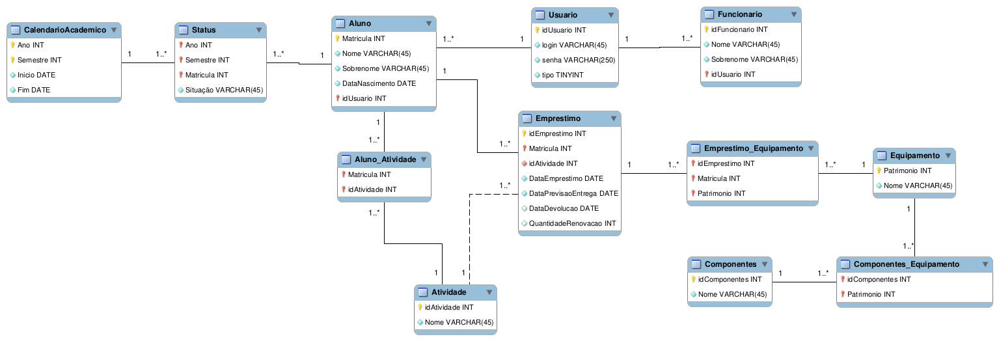

# Sistema de empréstimo
Este sistema irá auxiliar no controle de itens a serem emprestados em uma unidade escolar.\
E um dos propósito é que por meio da interface o aluno consiga renovar seu empréstimo, contudo, os empréstimos são limitados 
até três renovações, e o aluno só poderá renovar caso o empréstimo não esteja atrasado.\
De outra forma, o responsável pelos itens poderá realizar pelo sistemas os empréstimos, como
também, renovações, finalizar e listar os empréstimos ativos.

### Modelagem

### Dados dos alunos para autenticação:
|  idUsuario  |     login     |    Senha    | 
| :---------: | :-----------: |  :--------: |  
|      1      |  rafasantos   |  rafa1234   |   
|      2      |  pietroalves  |  al1234     | 
|      3      |  joanacosta   |  jo1234     | 
|      4      |  tonystark    |  tony1234   | 
|      5      |  biancalopes  |  bi1234     | 
|      6      |  caiosantana  |  caio1234   | 
|      7      |  rebecavieira |  rebeca1234 | 
|      8      |  mayasavelli  |  maya1234   | 
|      9      |  peterparker  |  peter1234  | 
|      10     |  nicolemedina |  ni1234     | 

### Dados dos funcionários para autenticação:
|  idUsuario  |     login     |    Senha    | 
| :---------: | :-----------: |  :--------: |
|      11     |    marlene    |  lene1234   | 
|      12     |  epaminondas  |  epa1234    | 

### Atividades:
Cada atividade está relaciona com o tempo de empréstimo.
Caso o aluno realize uma atividade de ensino o prazo estabelecido 
para estrega será de 15 dias corridos. Mas, caso seja das outras atividas,
como, pesquisa, extensão ou trabalho de conclusão, o aluno poderá efetuar
a devolução do item ao final do semestre. 

| idAtividade |      1      |      2      |      3      |      4      |
| :---------: | :---------: | :---------: | :---------: | :---------: |
|  Atividade  |    Ensino   |   Pesquisa  |   Extensão  |     TCC     |

### Alunos com empréstimos vigentes
Nesta tabela está todos os empréstimos que estão em vigência 

| idEmprestimo | idAtividade | Matrícula |   Nome   | Sobrenome | Data Nascimento | 
| :----------: | :---------: | :-------: | :------: | :-------: | :-------------: | 
|       6      |      1      | 201910016 |   Caio   |  Santana  |    1998-06-05   | 
|       7      |      4      | 201610002 |  Pietro  |   Alves   |    1993-06-15   | 
|       8      |      2      | 201820018 |  Rebeca  |   Vieira  |    2000-09-16   | 
|       9      |      3      | 201820014 |   Maya   |  Savelli  |    1999-02-03   | 
|       10     |      1      | 201910039 |   Peter  |   Parker  |    1996-08-10   | 

### Equipamentos com empréstimos vigentes
| idEmprestimo | Matrícula | Patrimônio |                   Nome                  |
| :----------: | :-------: | :--------: | :-------------------------------------: | 
|       6      | 201910016 |    2514    |            Mini Kit Arduino             |   
|       7      | 201610002 |    2517    | Placa FPGA Altera Cyclone II EP2C5T144  |   
|       8      | 201820018 |    3007    |                  Mouse                  |   
|       8      | 201820018 |    2515    |            Kit Raspberry Pi Basic       |   
|       9      | 201820014 |    2512    |            Kit Basic Arduino            |   
|      10      | 201910039 |    3005    |                 Cabo HDMI               |   

### Alunos com empréstimos atrasado
| idEmprestimo | idAtividade | Matrícula |   Nome   | Sobrenome | Data Nascimento | 
| :----------: | :---------: | :-------: | :------: | :-------: | :-------------: | 
|       5      |      1      | 201810015 |  Rafael  |   Santos  |    1990-12-12   | 

### Equipamento com empréstimos atrasado
| idEmprestimo | Matrícula | Patrimônio |            Nome            |
| :----------: | :-------: | :--------: | :------------------------: | 
|       5      | 201810015 |    2518    | Lego Mindstorms Education  |  

### Alunos que já fizeram empréstimos anteriormente
| idEmprestimo | idAtividade | Matrícula |   Nome   | Sobrenome | Data Nascimento | 
| :----------: | :---------: | :-------: | :------: | :-------: | :-------------: | 
|       1      |      1      | 201610002 |  Pietro  |   Alves   |    1993-06-15   | 
|       2      |      1      | 201920020 |  Joana   |   Costa   |    1998-03-01   | 
|       3      |      1      | 202020080 |   Tony   |   Stark   |    1994-05-29   | 
|       4      |      1      | 202010060 |  Bianca  |   Lopes   |    1999-05-21   | 

### Equipamentos que foram emprestados anteriormente
| idEmprestimo | Matrícula | Patrimônio |          Nome          |
| :----------: | :-------: | :--------: | :--------------------: | 
|       1      | 201610002 |    2516    | Kit Raspberry Pi Mega  |   
|       2      | 201920020 |    3010    |       Chave fenda      |  
|       3      | 202020080 |    3004    |      Cabo de Rede      |  
|       4      | 202010060 |    3001    |     Ferro de Solda     |  

### Aluno que não fez nenhum empréstimo
| Matrícula |   Nome   | Sobrenome | Data Nascimento | 
| :-------: | :------: | :-------: | :-------------: | 
| 201920999 |  Nicole  |   Medina  |    1998-11-13   | 

### Equipamento que não foi emprestado por nenhum aluno

| Patrimônio |         Nome           |
| :--------: | :--------------------: | 
|    2511    | Papilio One 250K FPGA  |   
|    2513    | nKit Arduino Advanced  |  
|    2519    | Kit Raspberry Pi Basic |  
|    2520    |    Kit Basic Arduino   |  
|    3002    |         Fenolite       |  
|    3003    |         Alicate        |  
|    3006    |         Cabo USB       | 
|    3008    |         Teclado        | 
|    3009    |         Estanho        | 